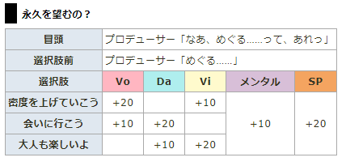
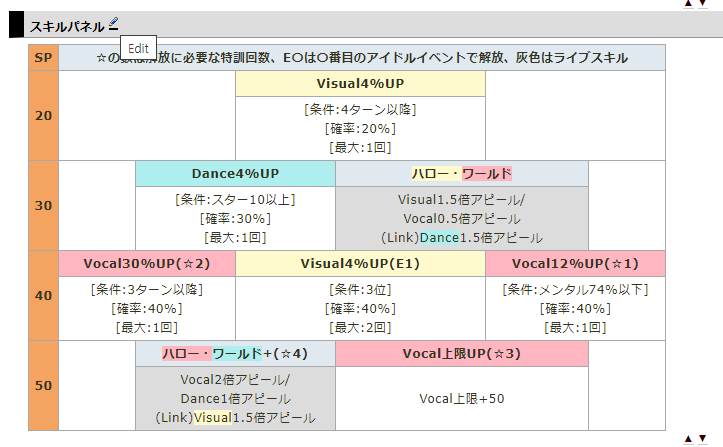

# wiki_converter

- `csv_to_wiki.py`: 한글패치 csv 파일을 shinycolors.info/wiki/의 문법에 맞게 변형합니다.  

- `skill_panel.py`, `commu.py`: 하단 설명 참고  

wikiwiki.sp/shinycolors의 데이터를 옮겨오기 위한 도구입니다  

CLI로 실행하는 것보다 IDE에서 run하고 console output 복붙하는게 빠르고 편해 현재와 같이 제작하였습니다

  

`Commu.py`는 카드 -> 아이돌 이벤트 의 제목 및 표를  
그대로 드래그, 복사, inp에 붙여넣고 
이름, 카드종류, 레어도, 카드정보를 수정하여 run, console output을 사용합니다  

  
`skill_panel.py`는 카드 -> 스킬 패널의 Edit을 누르고   
실제 표에 해당하는 부분 복사, inp에 붙여넣고 레어도를 수정해 run, console output을 사용합니다
